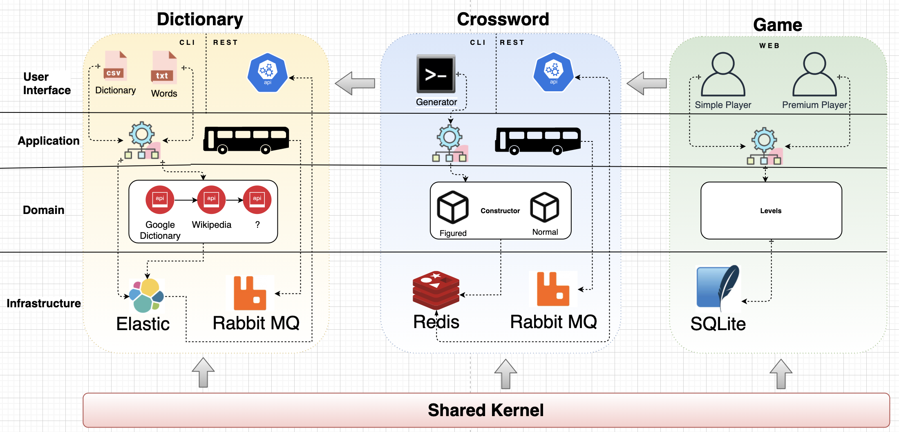
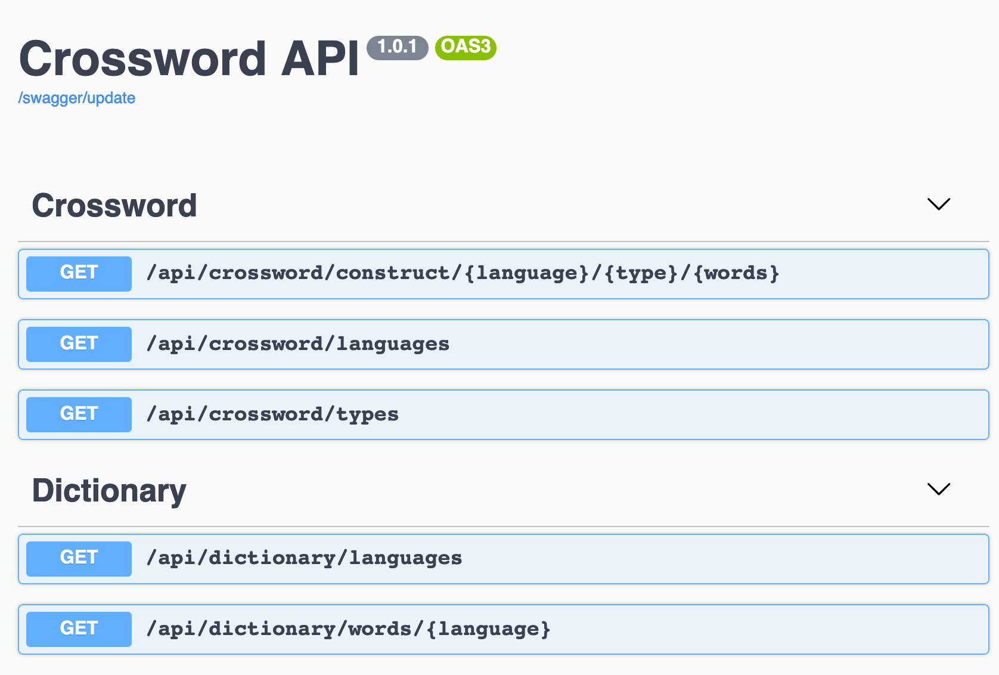

Crossword game
=======
[](https://github.com/dykyi-roman/crossword/blob/master/LICENSE)
[](https://php.net/)

# Example

...

# Architecture



### Layered Architecture

To make the code organised each context uses Layered Architecture and each functional area is divided on four layers:

* `Application`
* `Doman`
* `Infrastructure`
* `UI`

:+1: Checked by [Deptrac](https://github.com/qossmic/deptrac)

### ADR

Action Domain Responder organizes a single user interface interaction between an HTTP client and a HTTP server-side application into three distinct roles.

### DDD

Domain-driven design is not a technology or a methodology.
It is a way of thinking and a set of priorities, aimed at accelerating software projects that have to deal with complicated domains.

On a macro level using DDD concepts like Ubiquitous Language and Bounded Contexts can solve complex perspectives on data in to smaller models and clear data ownership.
Follow practices splitting the source code based on bounded contexts we define a next context:

* `Crossword`
* `Dictionary`
* `Game`

For reducing duplication of code we use a `SharedKernel`, it helps share a common code between context.

# Dictionary

### Rest Api

| Path                                             | Method | Scheme | Grant |
| ------------------------------------------------ | -------| ------ | ----- |
| /api/dictionary/languages                        | GET    | ANY    | ALL   |
| /api/dictionary/words/{LANGUAGE}?mask={MASK}     | GET    | ANY    | ALL   |

#### Response formats

* `json`
* `xml`

### Commands

Used to fill a dictionary with the help of a third party API providers:

```
php bin/console dictionary:populate {LANGUAGE-CODE} --{FILE-PATH}
```

Used to fill a dictionary from file:
```
php bin/console dictionary:upload {FILE-PATH} 
```

Collections with words for populate can be found: ``cd /data``

# Crossword

### Rest Api

| Path                                                    | Method | Scheme | Grant |
| ------------------------------------------------------- | -------| ------ | ----- |
| /api/crossword/construct/{LANGUAGE}/{TYPE}/{WORD-COUNT} | GET    | ANY    | ALL   |
| /api/crossword/languages                                | GET    | ANY    | ALL   |
| /api/crossword/types                                    | GET    | ANY    | ALL   |

#### Response formats

* `json`
* `xml`

### Commands

Used to generate a new crossword:

```
php bin/console crossword:generate {type} {WORD-COUNT} --{LIMIT}
```

# Game

...

# Docker

The docker-compose up command aggregates and run each container.

``
docker network create game
make start
``

# Swagger

Swagger help to describe the structure of APIs for better understand how is it works.

``URL: /swagger``
___



# Postman

Сollections with queries can be found: ``cd /postman``

:+1: Checked by [Newman](https://github.com/postmanlabs/newman)

## Stack

* PHP 8.0
* Symfony 5.2
* Elasticsearch
* RabbitMQ
* Redis
* SQLite
 
## Clean code support packages
* phpunit
* phpcs
* psalm
* rector
* phpcs-calisthenics-rules
* newman
* deptrac

## Resources

* [SPL](https://www.php.net/manual/en/book.spl.php)
* [Value objects](https://herbertograca.com/2020/07/07/value-objects/)
* [Data transfer objects](https://herbertograca.com/2020/06/23/dto-data-transfer-objects/)
* [Implementing Action-Domain-Responder Pattern With Symfony](https://medium.com/swlh/implementing-action-domain-responder-pattern-with-symfony-606539eea3a7)
* [Package by Feature](https://phauer.com/2020/package-by-feature/)

## Author
[Dykyi Roman](https://www.linkedin.com/in/roman-dykyi-43428543/), e-mail: [mr.dukuy@gmail.com](mailto:mr.dukuy@gmail.com)
