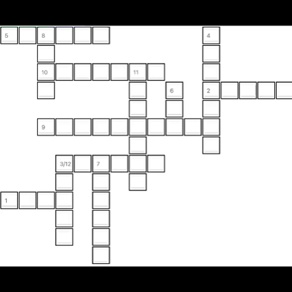
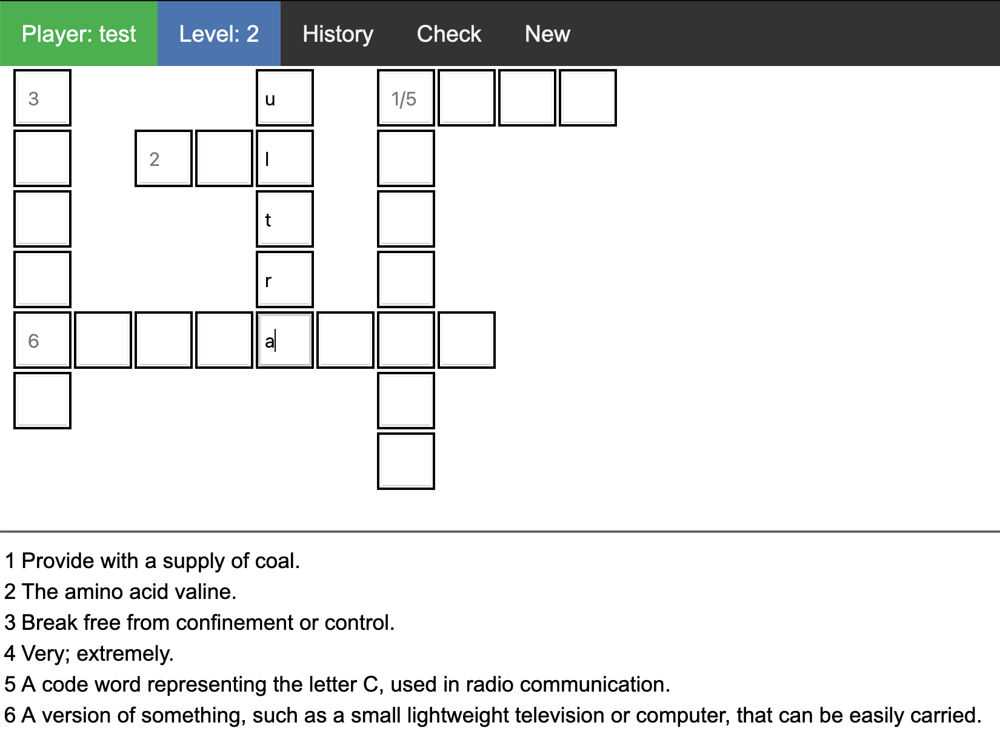

Crossword game
=======

The game is implemented as an example of scalable and high load architecture combined with modern software development practices

# Examples

# Project structure

| Packaging approach   | Branch                              | HEAD |
| -------------------- | ----------------------------------- | ---- |
| By features          | [feature/package-by-feature](https://github.com/dykyi-roman/crossword/tree/feature/package-by-feature) | master |
| By layers            | [feature/package-by-layer](https://github.com/dykyi-roman/crossword/tree/feature/package-by-layer)     |        |

# Architecture

**RabbitMQ** - need for handling commands and events asynchronous via the Symfony Messenger component.

**Elasticsearch** - used as storage for dictionary with 10,000 english and 10,000 russian words from the box.

**Redis** - used as a cache for generated crosswords.

**SQLite** - used as the main storage for player data and his game history.

### Microservices

To simplify the development and sharing of code, the Monorepository code storage approach was chosen.
Each module of the system is independents, and they can be separated like an independent microservice and communicate by API.

### Port and Adapters

To integrate existing, or a new modules applied solutions like the Port and Adapters pattern.

Ports are represented by Interfaces - `{modue}\Domain\Port`

These implementations will be the adapter - `{modue}\Infrastructure\Adapter`:
* `ApiAdapter` - used to API communicate with another module
* `DirectAdapter` - used to direct communicate with another module
* `InMemoryAdapter` - used to mock module in teh tests

### Layered 

To make the code organised each module uses Layered Architecture and each functional area is divided on four layers:

* `Application`
* `Doman`
* `Infrastructure`
* `UI`

Switch to check it [feature/package-by-layer](https://github.com/dykyi-roman/crossword/tree/feature/package-by-layer)

:+1: Checked by [Deptrac](https://github.com/qossmic/deptrac)

### ADR

Action Domain Responder organizes a single user interface interaction between an HTTP client and a HTTP server-side application into three distinct roles.

### DDD

Domain-driven design is not a technology or a methodology.
It is a way of thinking and a set of priorities, aimed at accelerating software projects that have to deal with complicated domains.

On a macro level using DDD concepts like Ubiquitous Language and Bounded Contexts can solve complex perspectives on data in to smaller models and clear data ownership.
Follow practices splitting the source code based on bounded contexts we define a next context:

* [Crossword](docs/Crossword.md) - algorithm for building crosswords
* [Dictionary](docs/Dictionary.md) - words storage 
* [Game](docs/Game.md) - game functionality

For reducing duplication of code we use a `SharedKernel`, it helps share a common code between context.

# Docker

The docker-compose up command aggregates and run each container.

``
docker network create game
``

``
make start
``

Open in browser

``
https://app.test:1001/game/play
``

# Swagger

Swagger help to describe the structure of APIs for better understand how is it works.

:+1:  ``URL: /swagger``

# Postman

Сollections with queries can be found: ``cd /postman``

:+1: Checked by [Newman](https://github.com/postmanlabs/newman)

## CI
* [Travis](https://travis-ci.com/github/dykyi-roman/crossword)
* [Scrutinizer](https://scrutinizer-ci.com/g/dykyi-roman/crossword/)

## Stack

* PHP 8.0
* Symfony 5.2
* Elasticsearch
* RabbitMQ
* Redis
* SQLite

## Clean code support packages
* phpunit
* phpcs
* psalm
* rector
* phpcs-calisthenics-rules
* newman
* deptrac

## Resources

* [SPL](https://www.php.net/manual/en/book.spl.php)
* [Value objects](https://herbertograca.com/2020/07/07/value-objects/)
* [Data transfer objects](https://herbertograca.com/2020/06/23/dto-data-transfer-objects/)
* [Implementing Action-Domain-Responder Pattern With Symfony](https://medium.com/swlh/implementing-action-domain-responder-pattern-with-symfony-606539eea3a7)
* [Package by Feature](https://phauer.com/2020/package-by-feature/)
* [Domain events](https://romaricdrigon.github.io/2019/08/09/domain-events)

## Author
[Dykyi Roman](https://www.linkedin.com/in/roman-dykyi-43428543/), e-mail: [mr.dukuy@gmail.com](mailto:mr.dukuy@gmail.com)
